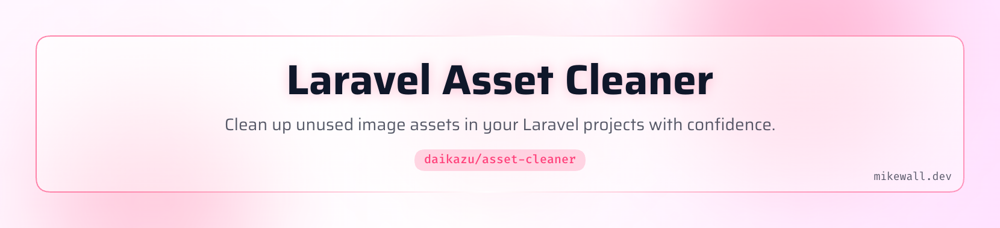

<picture>
   <source media="(prefers-color-scheme: dark)" srcset="art/header-dark.png">
   
</picture>

[](https://packagist.org/packages/daikazu/asset-cleaner)
[](https://github.com/daikazu/asset-cleaner/actions?query=workflow%3Arun-tests+branch%3Amain)
[](https://github.com/daikazu/asset-cleaner/actions?query=workflow%3A"Fix+PHP+code+style+issues"+branch%3Amain)
[](https://packagist.org/packages/daikazu/asset-cleaner)

# Laravel Asset Cleaner

This package helps you clean up your Laravel app in development by tracking down unused image files and Blade components. It scans through your codebase, finds where assets are referenced, and flags any leftover files that have no connection to the app so you can safely remove the clutter and keep things tidy.

## Features

### Image Asset Cleaner
- Scans configurable directories for image assets
- Searches Blade, PHP, JavaScript, Vue, CSS, and more for references
- Generates a reviewable manifest before deletion
- Supports dry-run mode to preview changes
- Automatic backup before deletion
- Protected patterns for critical assets (favicons, logos)
- One-shot "trust mode" for quick cleanup

### Blade Component Cleaner
- Detects unused anonymous (file-based) Blade components
- Detects unused class-based Blade components
- Deletes both PHP class and view file for class-based components
- Searches for multiple reference patterns (`<x-component>`, `@component()`, `view()`, etc.)
- Separate backup directory for component files
- Protected patterns for layout components

## Installation

Install the package via Composer:

```bash
composer require daikazu/asset-cleaner --dev
```

Publish the config file:

```bash
php artisan vendor:publish --tag="asset-cleaner-config"
```

## Quick Start

### Image Asset Cleaner

#### Step 1: Scan for unused assets

```bash
php artisan asset-cleaner:scan
```

This scans your project and generates an `unused-assets.json` manifest in your project root.

#### Step 2: Review the manifest

Open `unused-assets.json` and review the list of unused assets. Remove any entries for files you want to keep.

```json
{
    "generated_at": "2024-01-15T10:30:00+00:00",
    "total_scanned": 150,
    "total_unused": 12,
    "total_size_human": "2.5 MB",
    "assets": [
        {
            "path": "public/images/old-banner.jpg",
            "filename": "old-banner.jpg",
            "size_human": "450 KB"
        }
    ]
}
```

#### Step 3: Clean up

```bash
php artisan asset-cleaner:clean
```

This deletes the files listed in the manifest (with backup by default).

### Blade Component Cleaner

#### Step 1: Scan for unused components

```bash
php artisan blade-cleaner:scan
```

This scans your project for Blade components and generates an `unused-components.json` manifest.

#### Step 2: Review the manifest

Open `unused-components.json` and review the list of unused components. Remove any entries for components you want to keep.

```json
{
    "generated_at": "2024-01-15T10:30:00+00:00",
    "total_scanned": 45,
    "total_unused": 5,
    "total_size_human": "12 KB",
    "components": [
        {
            "name": "old-button",
            "view_path": "resources/views/components/old-button.blade.php",
            "is_class_based": false,
            "size_human": "1.2 KB"
        },
        {
            "name": "legacy-modal",
            "view_path": "resources/views/components/legacy-modal.blade.php",
            "is_class_based": true,
            "class_path": "app/View/Components/LegacyModal.php",
            "size_human": "3.5 KB"
        }
    ]
}
```

#### Step 3: Clean up

```bash
php artisan blade-cleaner:clean
```

This deletes the components listed in the manifest. For class-based components, both the PHP class and the Blade view are deleted.

## Commands

### Image Asset Commands

#### `asset-cleaner:scan`

Scan for unused image assets and generate a manifest.

```bash
# Generate manifest
php artisan asset-cleaner:scan

# Show statistics only (no manifest)
php artisan asset-cleaner:scan --stats
```

#### `asset-cleaner:clean`

Delete unused assets based on the manifest or perform a one-shot cleanup.

```bash
# Delete from manifest (with confirmation)
php artisan asset-cleaner:clean

# Preview what would be deleted
php artisan asset-cleaner:clean --dry-run

# Skip confirmation prompt
php artisan asset-cleaner:clean --force

# One-shot mode: scan and delete without manifest
php artisan asset-cleaner:clean --trust

# Combine flags for CI/CD
php artisan asset-cleaner:clean --trust --force --dry-run

# Skip backup
php artisan asset-cleaner:clean --no-backup
```

### Blade Component Commands

#### `blade-cleaner:scan`

Scan for unused Blade components and generate a manifest.

```bash
# Generate manifest
php artisan blade-cleaner:scan

# Show statistics only (no manifest)
php artisan blade-cleaner:scan --stats
```

#### `blade-cleaner:clean`

Delete unused components based on the manifest or perform a one-shot cleanup.

```bash
# Delete from manifest (with confirmation)
php artisan blade-cleaner:clean

# Preview what would be deleted
php artisan blade-cleaner:clean --dry-run

# Skip confirmation prompt
php artisan blade-cleaner:clean --force

# One-shot mode: scan and delete without manifest
php artisan blade-cleaner:clean --trust

# Combine flags for CI/CD
php artisan blade-cleaner:clean --trust --force --dry-run

# Skip backup
php artisan blade-cleaner:clean --no-backup
```

## Configuration

```php
// config/asset-cleaner.php

return [
    /*
    |--------------------------------------------------------------------------
    | Image Asset Cleaner Configuration
    |--------------------------------------------------------------------------
    */

    // Directories to scan for image assets
    'scan_paths' => [
        'public',
        'resources',
    ],

    // File extensions considered as images
    'image_extensions' => [
        'jpg', 'jpeg', 'png', 'gif', 'svg',
        'webp', 'ico', 'bmp', 'tiff', 'avif',
    ],

    // Directories to search for references
    'search_paths' => [
        'app',
        'resources',
        'routes',
        'config',
        'database',
    ],

    // File types to search for image references
    'search_extensions' => [
        'php', 'blade.php',
        'js', 'jsx', 'ts', 'tsx', 'vue', 'svelte',
        'css', 'scss', 'sass', 'less',
        'json', 'yaml', 'yml',
        'md', 'mdx',
    ],

    // Patterns to exclude from scanning
    'exclude_patterns' => [
        '**/node_modules/**',
        '**/vendor/**',
        '**/.git/**',
    ],

    // Protected files (never marked as unused)
    'protected_patterns' => [
        '**/favicon.ico',
        '**/favicon.png',
        '**/apple-touch-icon.png',
        '**/logo.*',
    ],

    // Manifest file location
    'manifest_path' => 'unused-assets.json',

    // Backup files before deletion
    'backup_before_delete' => true,
    'backup_path' => '.asset-cleaner-backup',

    /*
    |--------------------------------------------------------------------------
    | Blade Component Cleaner Configuration
    |--------------------------------------------------------------------------
    */

    'blade_cleaner' => [
        // Directories for anonymous components
        'anonymous_paths' => [
            'resources/views/components',
        ],

        // Directories for class-based components
        'class_paths' => [
            'app/View/Components',
        ],

        // Directories to search for component references
        'search_paths' => [
            'resources/views',
            'app',
            'routes',
            'config',
        ],

        // File types to search
        'search_extensions' => [
            'blade.php',
            'php',
        ],

        // Patterns to exclude
        'exclude_patterns' => [
            '**/vendor/**',
            '**/node_modules/**',
        ],

        // Protected components (never marked as unused)
        'protected_patterns' => [
            'layout',
            'layouts.*',
            'app-layout',
        ],

        // Manifest file location
        'manifest_path' => 'unused-components.json',

        // Backup directory (separate from image assets)
        'backup_path' => '.blade-cleaner-backup',
    ],
];
```

## Programmatic Usage

### Image Asset Cleaner

```php
use Daikazu\AssetCleaner\Facades\AssetCleaner;

// Get all image assets
$assets = AssetCleaner::scan();

// Find unused assets
$unused = AssetCleaner::findUnused();

// Get statistics
$stats = AssetCleaner::getStatistics();
// Returns: ['total' => 150, 'unused' => 12, 'used' => 138, ...]

// Generate manifest
AssetCleaner::generateManifest();

// Clean from manifest
$result = AssetCleaner::cleanFromManifest();

// One-shot cleanup
$result = AssetCleaner::cleanAll();

// Dry run
$result = AssetCleaner::cleanAll(dryRun: true);
```

### Blade Component Cleaner

```php
use Daikazu\AssetCleaner\Facades\BladeCleaner;

// Get all Blade components
$components = BladeCleaner::scan();

// Find unused components
$unused = BladeCleaner::findUnused();

// Get statistics
$stats = BladeCleaner::getStatistics();
// Returns: ['total' => 45, 'unused' => 5, 'used' => 40, ...]

// Generate manifest
BladeCleaner::generateManifest();

// Clean from manifest
$result = BladeCleaner::cleanFromManifest();

// One-shot cleanup
$result = BladeCleaner::cleanAll();

// Dry run
$result = BladeCleaner::cleanAll(dryRun: true);
```

## How It Works

### Image Asset Detection

1. **Scanning**: The package recursively scans configured directories for files matching image extensions.

2. **Reference Detection**: For each image found, the package searches your codebase for references using multiple strategies:
   - Full relative path (`public/images/hero.jpg`)
   - Path without `public/` prefix (`images/hero.jpg`)
   - Filename only (`hero.jpg`)
   - Filename without extension (`hero`)

3. **Manifest Generation**: Unused assets are written to a JSON manifest that you can review and edit.

4. **Deletion**: Files are deleted based on the manifest, with optional backup to `.asset-cleaner-backup/`.

### Blade Component Detection

1. **Scanning**: The package scans for:
   - Anonymous components in `resources/views/components/`
   - Class-based components in `app/View/Components/`

2. **Component Name Derivation**:
   - Anonymous: `resources/views/components/forms/input.blade.php` → `forms.input` → `<x-forms.input>`
   - Class-based: `App\View\Components\Forms\TextInput` → `forms.text-input` → `<x-forms.text-input>`

3. **Reference Detection**: For each component, the package searches for:
   - Component tags: `<x-component-name>`, `<x-component-name />`
   - Nested components: `<x-forms.input>`
   - Dynamic components: `<x-dynamic-component component="name">`
   - Legacy directive: `@component('components.name')`
   - Direct view calls: `view('components.name')`
   - Class registrations: `Blade::component()`

4. **Deletion**: For class-based components, both the PHP class and Blade view are deleted together.

## Best Practices

1. **Always review the manifest** before running clean, especially the first time.

2. **Use `--dry-run`** to preview changes before committing to deletion.

3. **Keep backups enabled** until you're confident in the results.

4. **Add to `.gitignore`**:
   ```
   unused-assets.json
   unused-components.json
   .asset-cleaner-backup/
   .blade-cleaner-backup/
   ```

5. **Protect critical assets** by adding patterns to `protected_patterns` in the config.

6. **Run after major refactors** when you've removed features or redesigned pages.

7. **Protect layout components** - they may not appear to be used if they're only referenced via `@extends`.

## Limitations

### Image Assets
- Dynamic image references (e.g., `asset($variable)`) may not be detected
- Images referenced only in the database won't be detected
- External CDN references are not tracked

### Blade Components
- Dynamic component names (e.g., `<x-dynamic-component :component="$var">`) with variables cannot be statically analyzed
- Components used only in tests may be flagged as unused
- Components conditionally rendered in rare scenarios may appear unused
- Livewire components are not currently supported (only standard Blade components)

For dynamic references, add the pattern to `protected_patterns` or remove entries from the manifest before cleaning.

## Testing

```bash
composer test
```

## Changelog

Please see [CHANGELOG](CHANGELOG.md) for more information on what has changed recently.

## Contributing

Please see [CONTRIBUTING](CONTRIBUTING.md) for details.

## Security Vulnerabilities

Please review [our security policy](../../security/policy) on how to report security vulnerabilities.

## Credits

- [Mike Wall](https://github.com/daikazu)
- [All Contributors](../../contributors)

## License

The MIT License (MIT). Please see [License File](LICENSE.md) for more information.
